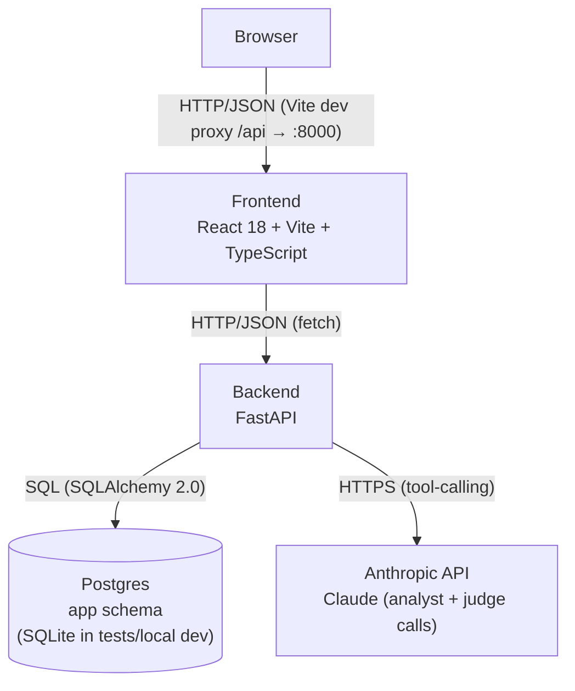
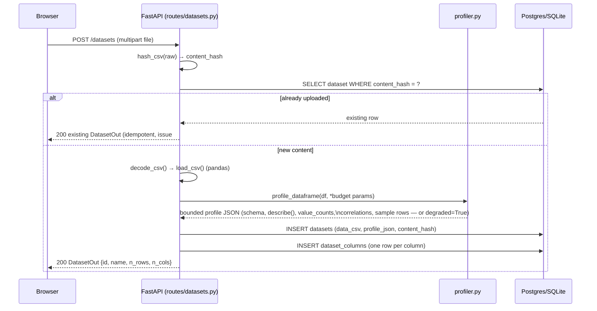
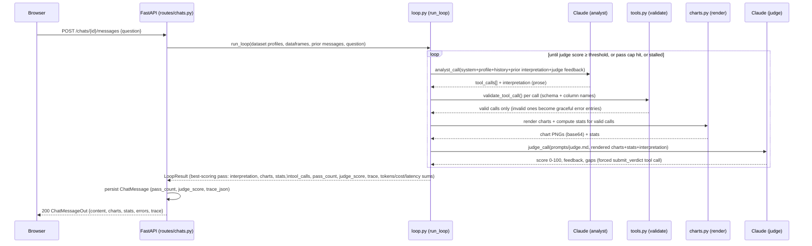
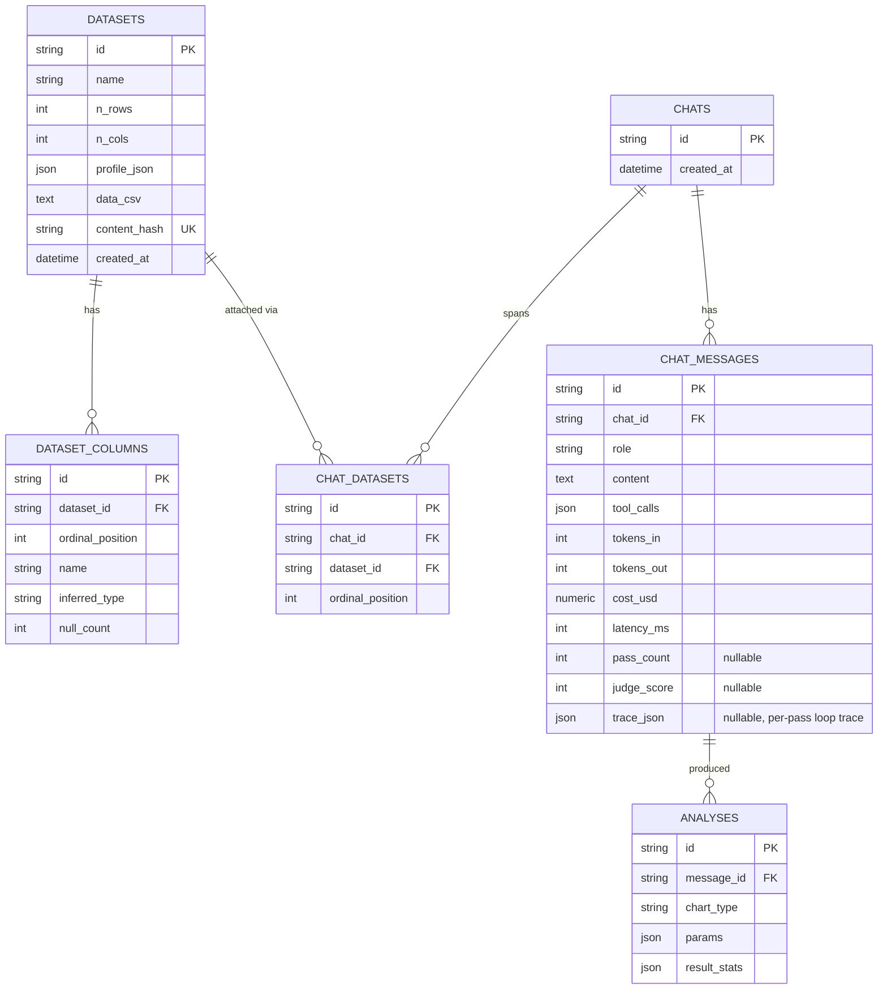

# Architecture Overview

This document is the single place to build a mental model of the CSV Analysis
Assistant: what it does, why each major piece exists, how data moves through
it, and what you'd change if the requirements changed. It's written for a
student who hasn't read the code yet — by the end, you should be able to draw
the diagrams from memory and explain the trade-offs out loud.

The authoritative list of numbered design decisions lives in
[`doc/project-1-csv-analysis-assistant-design.md`](project-1-csv-analysis-assistant-design.md)
(D1–D6) and the two decisions that superseded/extended it,
[`doc/project-1-llm-loop-design.md`](project-1-llm-loop-design.md) (issue #9)
and
[`doc/project-1-multi-dataset-chat-design.md`](project-1-multi-dataset-chat-design.md)
(issue #6). This document explains and illustrates those decisions with
diagrams; it does not replace them as the source of truth.

## 1. What this system does

Upload one or more CSVs. Start a chat over them. Ask a question in plain
English — *"is income correlated with age?"* — and get back a chart, the
underlying statistics, and an LLM-written interpretation of what you're
looking at. There's no generic code-execution sandbox: Claude picks from a
**fixed menu** of four pandas/matplotlib tools (`histogram`, `scatter`,
`correlation_matrix`, `compare`), the backend validates every argument against
the dataset's actual schema before running anything, and the interpretation is
graded by a second, independent LLM call before it's shown to you.

## 2. High-Level Architecture

The data store (Postgres) and the compute path (FastAPI ↔ Anthropic) are
deliberately separate boxes: the backend is the only thing that talks to
either. The frontend never calls Anthropic directly and never sees a database
connection string.

## 3. Tech Stack

| Layer | Technology | Why |
|---|---|---|
| Language (backend) | Python 3.12 | Typed, mature data/ML ecosystem (pandas, matplotlib); mypy strict catches contract drift early. |
| Web framework | FastAPI | Async-capable, Pydantic-native request/response validation, auto-generated `/docs`. |
| ORM | SQLAlchemy 2.0 | Typed `Mapped[...]` models catch column-type mistakes at the type-checker, not at runtime. |
| Migrations | Alembic | Versioned, reviewable schema changes on Postgres; `alembic upgrade head` at startup keeps prod self-healing. |
| Database | Postgres (`app` schema) in prod; SQLite in tests/local dev | Postgres for real concurrency and constraints; SQLite needs zero setup for a workshop laptop. |
| LLM | Claude, via the Anthropic Python SDK | Native tool-calling (function-calling) maps directly onto the fixed chart-tool menu. |
| Charting | matplotlib (`Agg` backend) + seaborn | `Agg` is non-interactive and thread-safe — required under a multi-worker web server; seaborn styles the fixed chart set. |
| Frontend | React 18 + Vite + TypeScript | Fast dev server with proxying; TypeScript keeps the API response shapes honest across the fetch boundary. |
| Frontend components | Radix UI primitives (`@radix-ui/react-dialog`) + hand-rolled CSS-variable design tokens | One real dependency for accessible primitives (focus trap, ARIA) the team won't reinvent; everything else is tokenized and owned. |
| Backend tests | pytest + httpx | `TestClient`-driven request/response tests against an isolated SQLite DB per test. |
| Frontend tests | Vitest + React Testing Library | Mocked `fetch`, assertions on roles/text/`data-*` (CSS modules aren't loaded in tests, so class names can't be asserted on). |
| Dependency management | Poetry (backend), npm (frontend) | Poetry pins a reproducible `poetry.lock`; npm is the frontend ecosystem default. |

## 4. Data & Process Flow

### 4.1 Upload flow

The raw CSV text is the *only* durable copy (D5) — there's no object store and
no parquet conversion. `profile_dataframe()` is deliberately bounded (§6 below)
because its output is what gets pasted into every LLM prompt for every turn of
every chat over that dataset; an unbounded profile would make token cost scale
with the dataset's cardinality, not with the conversation.

### 4.2 Chat flow — the judge-gated loop (issue #9)

This is the one part of the system that most looks like a single request but
runs multiple LLM calls in a loop. A **pass** is one analyst call + validation
+ rendering + one judge call.

Three things about this loop are easy to miss on a first read:

- **The judge scores the actual rendered output, not a prediction of it.** The
  analyst doesn't get to grade its own homework — the judge call only ever
  sees charts and stats that were really produced by really running the
  tools, after backend validation. This is the whole point of separating the
  two calls: it catches an analyst that describes a chart it didn't actually
  make, or hallucinates a trend the real data doesn't show.
- **The loop returns the best-scoring pass, not the last one.** If pass 2
  scores higher than pass 3, pass 2 wins. A later pass can make things worse
  (a bad revision instruction, a dropped chart) and the loop doesn't reward
  merely being the last to run.
- **The system prompt never leaves the backend.** Not in the response, not in
  the stored trace, no UI toggle. It's excluded by construction because it can
  contain guardrail language that shouldn't be exposed to end users. This is
  worth remembering if you're ever asked to "just also return the system
  prompt for debugging" — that request has already been considered and
  deliberately declined.

The loop stops on whichever comes first: the judge score clears
`Settings.llm_quality_threshold` (default 80), `Settings.llm_max_passes`
(default 3) is reached, or the pass **stalls** (adds no new charts and the
judge score doesn't improve on the best seen so far — no point burning another
pass on a plateau).

## 5. Data Model

Notes that explain *why* it looks like this, not just what it is:

- **No `users` table, anywhere (D4).** A dataset's `id` and a chat's `id` are
  each their own shareable link. There's no login, no session, no per-user
  scoping. This is a deliberate Project-1 boundary — auth is Project 2's job.
- **`chats` has no `dataset_id` column.** A chat spans *N* datasets through the
  `chat_datasets` join table (issue #6), fixed at chat creation — there's no
  mid-chat "attach another dataset." `ordinal_position` preserves the order
  they were passed in, since that order matters for the `compare` tool (it
  always compares exactly two datasets and needs a stable "first" vs.
  "second").
- **Charts are never stored as rows or files.** There's no `chart_urls`
  column and no image directory on disk. A chart is a pure function of
  `data_csv` + a message's `tool_calls`; on every history read
  (`GET /chats/{id}`), the backend re-renders from those two inputs. The one
  deliberate exception is `chat_messages.trace_json`, which *does* store
  rendered PNGs per pass — accepted because the trace UI needs to show
  exactly what the judge saw, and re-rendering intermediate (non-final)
  passes on every reload would be wasted work for something users rarely
  expand.
- **`pass_count` / `judge_score` / `trace_json` are all nullable** because
  rows predating the loop (or, rarely, a turn where every judge call failed)
  never populated them.

## 6. Interface Contracts

### REST API surface

| Method | Path | Request | Response | Notes |
|---|---|---|---|---|
| GET | `/health` | — | `{"status": "ok"}` | Liveness only. |
| POST | `/datasets` | multipart `file` | `DatasetOut {id, name, n_rows, n_cols}` | 400 on unparseable/empty CSV or non-`.csv` name; 413 over size/row caps; idempotent by content hash. |
| GET | `/datasets` | — | `list[DatasetOut]` | Newest first; column-projected query (never hydrates `data_csv`/`profile_json` on this hot path). |
| GET | `/datasets/{id}` | — | `DatasetOut` | 404 if missing. |
| POST | `/chats` | `{"dataset_ids": [str, ...]}` | `ChatOut {id, datasets: [{id, name}]}` | 400 if empty; 404 if any dataset id is unknown. |
| POST | `/chats/{id}/messages` | `{"question": str}` | `ChatMessageOut {id, role, content, charts, stats, errors, trace}` | Runs the full judge-gated loop; can take longer than a single API call. |
| GET | `/chats/{id}` | — | `ChatHistoryOut {datasets, messages}` | Re-renders charts from `tool_calls` on every call; the stored `trace_json` (if present) is returned verbatim. |

### Internal interfaces worth knowing by name

- `profile_dataframe(df, *, sample_rows, max_cardinality, max_corr_cols, top_corr_pairs, token_budget) -> dict` (`app/profiler.py`) — the bounded profile Claude actually reads. Returns `degraded=True` and falls back to schema + `describe()` + correlations only if the full profile would exceed `token_budget`.
- `validate_tool_call(call, profiles) -> ValidatedCall | ToolError` (`app/tools.py`) — checks a Claude-proposed tool call's dataset id, column names, and types against the real profile before anything touches pandas. Never trust raw model output.
- `run_loop(dataset_infos, dataframes, prior_messages, question) -> LoopResult` (`app/loop.py`) — the orchestrator described in §4.2; returns the best-scoring pass plus the full per-pass `trace`.
- Frontend `api.ts` — `uploadDataset()`, `listDatasets()`, `getDataset()`, `createChat()`, `getChat()`, `postChatMessage()` — thin `fetch` wrappers whose return types are the same `*_Out` shapes the backend's Pydantic schemas define, kept in sync by hand in `frontend/src/types.ts`.

## 7. Integration Patterns

**LLM tool-calling, twice, for different purposes.** The analyst call gets a
tool schema built from a **fixed menu** (`histogram`, `scatter`,
`correlation_matrix`, `compare` — see `app/tools.py`); Claude's response is
parsed for `tool_calls`, each one validated against the real dataset profile,
then executed. The judge call is a *different* tool-calling use: it's forced
to call a single `submit_verdict` tool (see `prompts/judge.md`) so its score
and feedback arrive as structured data, not prose that would need parsing.

**Profiler token-budget degradation.** `profile_dataframe()` enforces caps —
`value_counts` only for columns with cardinality ≤ `profile_max_cardinality`,
correlations capped at `profile_top_corr_pairs` beyond
`profile_max_corr_cols` numeric columns, `profile_sample_rows` sample rows —
and if the assembled profile still exceeds `profile_token_budget`, it degrades
to schema + `describe()` + correlations only. In multi-dataset chats, this
budget is checked against `profile_token_budget * n_datasets`, degrading
`sample_rows` first across all datasets before falling back further.

**matplotlib `Agg`, fresh `Figure` per call.** The analysis engine
(`app/analysis.py`) never touches `pyplot`'s global state — it isn't
thread-safe under a multi-worker FastAPI process. Every chart function creates
its own `Figure`, renders to it, and closes it, so concurrent requests can
never bleed into each other's plots.

**SQLite in tests, Postgres in prod, one code path.** The `client` pytest
fixture (`conftest.py`) overrides the `get_session()` FastAPI dependency with
an isolated, ephemeral SQLite session per test — no shared state between
tests, and no mocking of the ORM layer itself. Production wires the same
`get_session()` to a real Postgres engine via `DATABASE_URL`. `init_db()`
branches once, at startup: `alembic upgrade head` for Postgres,
`Base.metadata.create_all()` for SQLite.

**Backend validates before executing, always.** Every tool call Claude
proposes is checked against the dataset's actual profiled columns and types
before it reaches a pandas/matplotlib function. A mismatched column name or
type produces a graceful per-call error entry in the response — it never
raises inside the analysis engine, and raw model output is never passed
through unchecked.

## 8. Key Design Decisions

Format: **Context → Decision → Trade-offs → When to revisit.**

**D2 (superseded) — from single-pass to a judge-gated loop.**
*Context:* the original design ran one LLM call that picked tools, wrote
prose, and had no way to check its own work. *Decision:* replaced with the
loop in §4.2 — a separate judge call scores the analyst's actual rendered
output and the loop retries with feedback until a quality bar is cleared or a
pass cap is hit. *Trade-offs:* a chat turn can now take several times longer
and cost several times more tokens than a single call, in exchange for
catching hallucinated or mismatched interpretations before the user sees them.
*When to revisit:* if latency/cost becomes the binding constraint over
answer quality, consider lowering `llm_max_passes` or raising
`llm_quality_threshold` less aggressively — or moving the judge to a cheaper
model via `JUDGE_MODEL`.

**D4 — no auth, no `users` table.**
*Context:* Project 1 is single-workshop, single-tenant. *Decision:* a
dataset/chat `id` is its own access control — anyone with the link can view
or continue it. *Trade-offs:* zero login friction for a workshop, zero data
isolation between anyone who has (or guesses) an id. *When to revisit:* the
Project 2 fork, which adds real auth and user scoping — do not add a `User`
model or FK here.

**D5 — raw CSV in Postgres, no object store.**
*Context:* uploaded data needs one durable, queryable-adjacent home.
*Decision:* store the decoded CSV verbatim as `Text` in `datasets.data_csv`;
`load_csv()` is the single parser used at both upload-time profiling and
later chart re-render, so both stages see identical dtypes. *Trade-offs:* no
compression (a 50 MB upload stays ~50 MB in the database) and no S3/GCS
tier, bounded by `MAX_UPLOAD_BYTES`. *When to revisit:* if upload sizes grow
past what's comfortable to keep in Postgres text columns, or if the
ephemeral-filesystem constraint of the target deploy platform changes.

**D6 — eval suite kept separate from unit tests.**
*Context:* grading whether an LLM's answer is *good* (not just
well-typed) requires real API calls at real cost, which offline unit tests
must never depend on. *Decision:* `make eval` hits the real Anthropic API at
temperature 0 against a fixed golden question set and grades tool selection,
column choice, and interpretation keyword presence — kept out of `make test`
and `make check` entirely. *Trade-offs:* the eval suite costs money and time
to run, so it isn't part of CI's default gate. *When to revisit:* `make eval`
is currently a stub (prints a message only) — a later plan authors the real
suite; see the write-up in `CLAUDE.md`.

**Issue #6 — multi-dataset chat via a join table, not a `dataset_id` column.**
*Context:* users wanted to ask cross-dataset questions (e.g., compare two
CSVs) without redesigning what a "chat" is. *Decision:* `chat_datasets` joins
chats to N datasets, fixed at creation; a `compare` tool does an in-memory
inner-join aggregation across exactly two of them. *Trade-offs:* no mid-chat
"attach a dataset" — you start a new chat instead. *When to revisit:* if a
workflow genuinely needs mid-conversation dataset attachment, this is the
seam to redesign.

**Issue #9 review — the loop trace is exposed in the UI, system prompt is not.**
*Context:* reviewers wanted visibility into *why* a given pass scored the way
it did, not just the final answer. *Decision:* `run_loop()` returns a
per-pass trace (analyst interpretation, judge score/feedback/gaps, rendered
charts, the revision instruction fed to the next pass); the frontend renders
it as a collapsible block per pass. *Trade-offs:* this is the one deliberate
exception to "charts are never stored" — trace PNGs *are* persisted verbatim,
accepted for the storage cost. The system prompt is never included, by
design — it can leak guardrail language. *When to revisit:* if trace storage
cost becomes material, consider pruning older non-winning passes' PNGs
instead of exposing the system prompt as a trade-off — those are separate
concerns and shouldn't be conflated.

## 9. Learning Checkpoints

After reading this document, you should be able to answer each of these
without looking anything up:

1. Walk me through what happens, component by component, when a user uploads
   a CSV.
2. Why does the profiler have a token budget, and what does it do when the
   profile would exceed it?
3. What would break if the backend stored rendered chart images as files
   instead of re-rendering them from `tool_calls` on every history read? Why
   is the loop trace a deliberate exception to that rule?
4. Why does the system run *two* separate LLM calls per pass instead of one,
   and what does the judge call actually see?
5. Why does the loop return the best-scoring pass instead of the last pass
   run?
6. What are the three conditions that stop the loop, and what does "stalled"
   mean in that context?
7. Why is there no `dataset_id` column on `chats`, and what does
   `chat_datasets.ordinal_position` protect?
8. What would you need to add to support user accounts, and why does that
   arrive in Project 2 instead of here?
